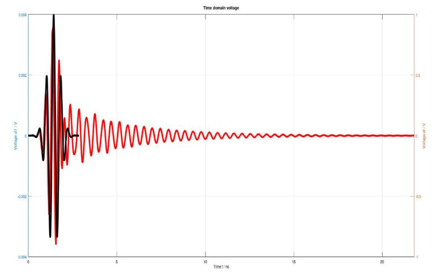
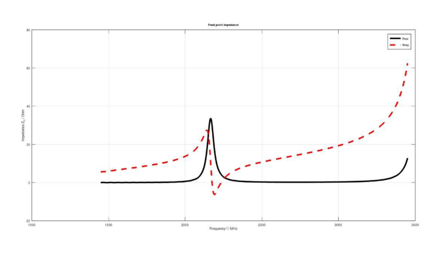
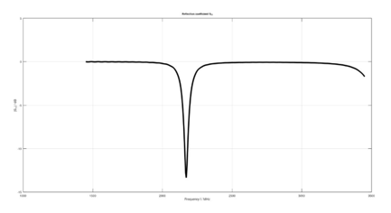
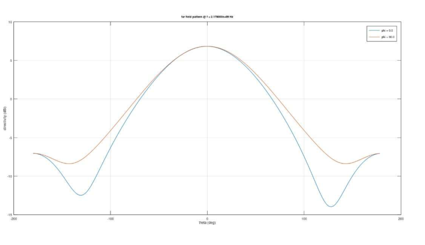

# 📡 Simulation of Patch Antenna with Metamaterial Superstrate


---

# 📖 Overview

This project focuses on the **design and simulation of a Rectangular Microstrip Patch Antenna** operating at **2.45 GHz** using **GNU Octave** and **OpenEMS**. A **Metamaterial Superstrate** is incorporated above the antenna to enhance its performance by improving impedance matching, radiation characteristics, gain, and directivity.

The antenna performance is evaluated by analyzing:

- Reflection Coefficient (S11)
- Feed Impedance
- Radiation Pattern
- 3D Far-Field Radiation Pattern

---

# 🎯 Objectives

- Design a Rectangular Microstrip Patch Antenna operating at **2.45 GHz**.
- Improve antenna performance using a **Metamaterial Superstrate**.
- Analyze the Reflection Coefficient (S11).
- Analyze Feed Impedance.
- Study the Radiation Pattern.
- Visualize the 3D Far-Field Radiation Pattern.

---

# ✨ Features

- 📡 Rectangular Microstrip Patch Antenna Design
- 🛰️ Metamaterial Superstrate
- 📊 Reflection Coefficient (S11) Analysis
- 📈 Feed Impedance Analysis
- 🌐 Far-Field Radiation Pattern
- 🧩 3D Antenna Visualization
- ⚡ OpenEMS FDTD Electromagnetic Simulation

---

# 🛠️ Software Used

- GNU Octave
- OpenEMS
- CSXCAD
- ParaView

---

# 📐 Antenna Parameters

| Parameter | Value |
|------------|--------|
| Operating Frequency | 2.45 GHz |
| Patch Width | 32.86 mm |
| Patch Length | 41.37 mm |
| Substrate Size | 60 mm × 60 mm |
| Substrate Thickness | 1.524 mm |
| Relative Permittivity | 3.38 |
| Metamaterial Permittivity | 12 |
| Metamaterial Thickness | 3 mm |
| Feed Position | −5.5 mm |
| Feed Width | 2 mm |
| Feed Resistance | 50 Ω |

---

# ⚙️ Simulation Workflow

1. Design the Rectangular Patch Antenna.
2. Create the Ground Plane.
3. Define the Dielectric Substrate.
4. Add the Metamaterial Superstrate.
5. Configure the Lumped Port Feed.
6. Generate the Computational Mesh.
7. Perform FDTD Simulation using OpenEMS.
8. Calculate Feed Impedance.
9. Compute Reflection Coefficient (S11).
10. Generate Far-Field Radiation Pattern.
11. Visualize the 3D Radiation Pattern.

---

# 📂 Repository Structure

```
Patch-Antenna-with-Metamaterial-Superstrate
│
├── Documentation
│   └── EMF_REPORT_FINAL.pdf
│
├── Simulation-Results
│   ├── time_voltage_graph.png
│   ├── impedance_graph.png
│   ├── reflection_coefficient_s11.png
│   ├── far_field_pattern.png
│   └── antenna_3d_visualization.png
│
├── README.md
│
└── LICENSE
```

---

# 📊 Simulation Results

## 1️⃣ Time Domain Voltage

The time-domain voltage graph represents the transient response of the antenna during simulation.

<p align="center">
  
</p>

---

## 2️⃣ Feed Impedance

The feed impedance graph illustrates the variation of the antenna input impedance across the operating frequency range. The impedance is close to **50 Ω**, indicating proper impedance matching.

<p align="center">
  
</p>

---

## 3️⃣ Reflection Coefficient (S11)

The Reflection Coefficient (S11) graph shows that the antenna achieves a return loss below **−10 dB** at **2.45 GHz**, indicating good impedance matching and efficient power transfer.

<p align="center">
  
</p>

---

## 4️⃣ Far-Field Radiation Pattern

The far-field radiation pattern illustrates the directional characteristics of the antenna. The addition of the metamaterial superstrate enhances the directivity of the antenna.

<p align="center">
  
</p>

---

## 5️⃣ 3D Antenna Visualization

The three-dimensional radiation pattern provides a complete visualization of the antenna's radiation characteristics. The main radiation lobe is directed toward the **+Z-axis**, demonstrating improved beam focusing.

<p align="center">
  
</p>

---

# 📈 Key Results

- Operating Frequency: **2.45 GHz**
- Reflection Coefficient (S11): **Below −10 dB**
- Feed Impedance: **Approximately 50 Ω**
- Improved Directivity using Metamaterial Superstrate
- Enhanced Radiation Characteristics

---

# 🚀 Future Improvements

- Fabrication of the proposed antenna.
- Experimental validation using a Vector Network Analyzer (VNA).
- Gain optimization using advanced metamaterial structures.
- Multi-band antenna design.
- HFSS/CST implementation for performance comparison.

---

# 📄 Documentation

The complete project report is available in the **Documentation** folder and includes:

- Theory
- Antenna Design
- OpenEMS Simulation Code
- Simulation Setup
- Results
- Conclusion

---

# 👩‍💻 Author

**Nishandhini S**

Electronics and Communication Engineering  
Embedded Systems | IoT | RF & Antenna Design


